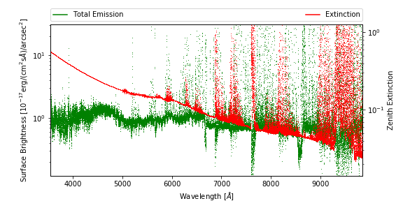
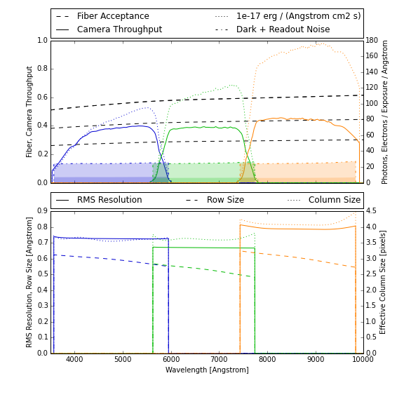
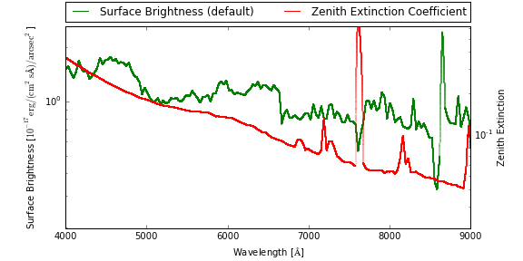
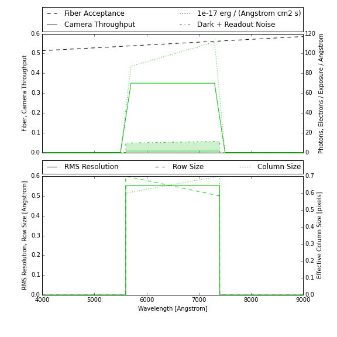

Configuration
=============

This section describes how a simulation is configured using information read
from files and command-line options.  For an overview of how a simulation is
performed and what parameters it requires see the :doc:`/guide`. Configuration
options specify the instrument, atmosphere and source to simulate, and how
the simulation should be performed.

This package originated as a DESI-specific simulation tool but, as of v0.3,
has no code dependencies on DESI software and makes no hardcoded assumptions
that are specific to DESI.  Instead, any fiber spectrograph and observing
conditions can be configured.  Several configurations are included with the
code distribution and described below.  New configurations are straightforward
to create using these examples as templates.

This document provides a user-oriented view of configuration, and focuses on the
tasks of interpreting end editing configuration files.  For a
developer-oriented view, see the :doc:`API documentation </api>`.

Configuration File
------------------

The top-level configuration is specified by a single YAML file with four main
sections: atmosphere, instrument, source, and simulator. This top-level file
refers to additional files containing tabulated data, which are generally large
and packaged separately.  For example, the DESI configuration refers to files
in the `desimodel package <https://github.com/desihub/desimodel>`__.

Something about wavelength_grid and base_path...

A valid configuration file is a YAML file whose hierarchy is specified using
only mappings (dictionaries), with no sequences (lists). All mapping keys
must be `valid python identifiers
<https://docs.python.org/2/reference/lexical_analysis.html#identifiers>`__,
and custom objects are not supported.

The various configuration sections share some common syntax for specifying
physical constants and tabular data, as described in the following sections.

Constants
^^^^^^^^^

Physical constants are grouped within a ``constants`` node and consists of a
list of name-value pairs, for example::

    constants:
        read_noise: 2.9 electron
        dark_current: 2.0 electron/(hour pixel**2)
        gain: 1.0 electron/adu

Units are optional but, when present, must be separated from the value with some
white space.  Units are interpreted by the :mod:`astropy.units` module.

Tabulated Data
^^^^^^^^^^^^^^

Tabulated data is read using :func:`astropy.table.Table.read` so is very flexible.
A simple table node to specify a function of wavelength might look like::

    table:
        path: throughput.csv
        columns:
            wavelength: { index: 0, unit: Angstrom }
            throughput: { index: 1 }

In this example, the file format is automatically determined by the filename
extension and the required columns are identified by their indices (0, 1) in
the file. Tabulated data generally requires units, but these can be specified
in the configuration file instead of the data file, for more flexibility.

Here is a more complex example of reading data from a binary table within a
multi-HDU FITS file::

    table:
        path: throughput.fits
        hdu: THRU
        wavelength: { name: wave }
        throughput: { name: thru }

In this case the HDU and columns are identified by their names in the FITS file.

Finally, some tabulated data uses different files to represent different options.
For example, sky surface brightness tables under different conditions are
specified by replacing the ``path`` node with a ``paths`` node as follows::

    paths:
        dark: dark-sky.csv
        grey: grey-sky.csv
        bright: bright-sky.csv

For additional examples of specifying tabular data, refer to the configurations
included with this package and described below.

DESI Configuration
------------------

Atmosphere
^^^^^^^^^^

Instrument
^^^^^^^^^^

Test Configuration
------------------

Atmosphere
^^^^^^^^^^

Instrument
^^^^^^^^^^

